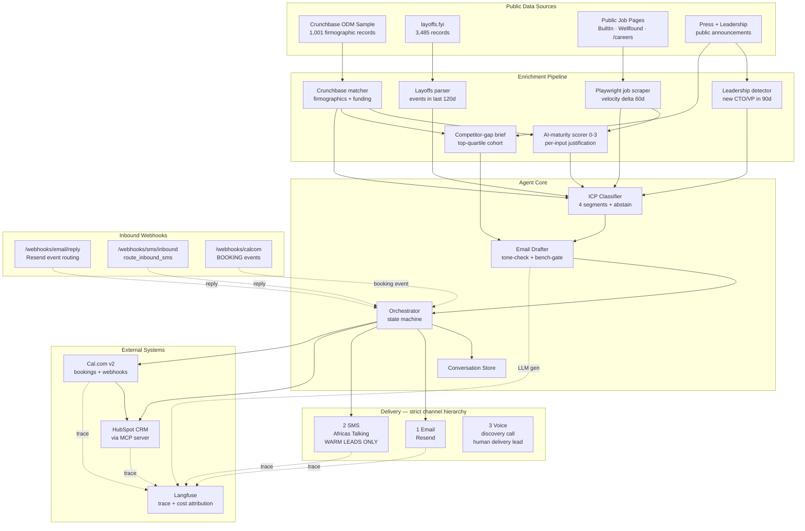
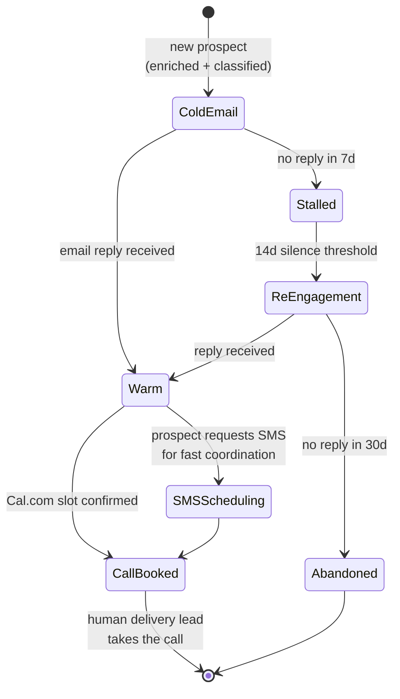

# Conversion Engine

**Automated lead generation and conversion for Tenacious Consulting & Outsourcing.**

Finds net-new prospective clients from public data, qualifies them against a real intent signal, runs a voice-preserving nurture sequence, and books discovery calls — with every interaction written back to HubSpot and every claim auditable through a signed trace.

- **Framework:** FastAPI · Python 3.12 · [uv](https://docs.astral.sh/uv/)
- **LLM:** OpenRouter (dev-tier: DeepSeek V3 · eval-tier: Claude Sonnet 4.6)
- **Stack:** Resend · Africa's Talking · HubSpot MCP · Cal.com · Langfuse
- **Benchmark:** τ²-Bench retail (Sierra Research)
- **Status:** Acts I + II complete · interim submission 2026-04-23

---

## Table of Contents

1. [What this is](#what-this-is)
2. [Architecture](#architecture)
3. [Quick start](#quick-start)
4. [Configuration](#configuration)
5. [Running the agent](#running-the-agent)
6. [Testing](#testing)
7. [Deployment](#deployment)
8. [Project layout](#project-layout)
9. [Channel hierarchy & policy](#channel-hierarchy--policy)
10. [Design decisions](#design-decisions)
11. [Observability](#observability)
12. [Data handling](#data-handling)
13. [License & attribution](#license--attribution)

---

## What this is

The Conversion Engine is a production-grade prospecting and conversion system built for Tenacious Consulting. It executes a four-stage pipeline per prospect:

1. **Enrich** — merges public signals from Crunchbase, layoffs.fyi, job-post pages (Playwright), and press releases into a structured `hiring_signal_brief.json` with per-signal confidence scores.
2. **Classify** — assigns each prospect to one of four ICP segments (recently-funded / mid-market-restructuring / leadership-transition / capability-gap), with an explicit **abstain** option when confidence is low.
3. **Draft** — composes a signal-grounded email in the Tenacious voice, with a tone-preservation check, bench-gated commitments, and confidence-aware phrasing (ASK vs. ASSERT).
4. **Deliver** — sends via Resend (email), falls back to Africa's Talking (SMS, warm leads only), writes every conversation event to HubSpot via its MCP server, and books the discovery call in Cal.com.

The system is graded on the **evidence graph**: every numeric claim in the final memo must resolve to a trace file the reviewer can open. Cost per qualified lead, latency percentiles, and reply-rate deltas are all derived from traces, not assertions.

---

## Architecture

### System components



### Conversation state machine



SMS is gated at the channel boundary: `send_sms(warm_lead=False)` raises `SMSChannelPolicyError`. Cold SMS to Tenacious-segment prospects (founders, CTOs, VPs Engineering) is a documented brand risk and is impossible to trigger from code.

---

## Quick start

### Prerequisites

- **Python 3.12+**
- **[uv](https://docs.astral.sh/uv/)** — `curl -LsSf https://astral.sh/uv/install.sh | sh`
- **Node.js 18+** — required for the HubSpot MCP server (`npx @hubspot/mcp-server`)
- **Playwright** browsers — installed in step 3 below

### Installation

```bash
git clone https://github.com/Sanoy24/conversion-engine.git
cd conversion-engine

# 1. Install Python deps (pinned via uv.lock)
uv sync

# 2. Copy env template and fill in API keys (see Configuration below)
cp .env.example .env
${EDITOR:-vim} .env

# 3. Install Playwright browsers (for job-post scraping)
uv run playwright install chromium

# 4. Verify everything is wired
uv run pytest tests/ -q
```

---

## Configuration

All settings are loaded from environment variables (via `pydantic-settings`). The `.env.example` file lists every variable with a placeholder; the table below groups them by purpose.

| Variable                    | Required | Purpose                                                                                                        |
| --------------------------- | :------: | -------------------------------------------------------------------------------------------------------------- |
| `OPENROUTER_API_KEY`        |    ✅    | LLM backbone (dev and eval tiers both route through OpenRouter)                                                |
| `DEV_MODEL`                 |          | Dev-tier model. Default `deepseek/deepseek-chat-v3-0324`                                                       |
| `EVAL_MODEL`                |          | Eval-tier model. Default `anthropic/claude-sonnet-4-20250514`                                                  |
| `RESEND_API_KEY`            |    ✅    | Email delivery (primary channel)                                                                               |
| `RESEND_FROM_EMAIL`         |    ✅    | Verified sender domain, e.g. `outbound@yourdomain.com`                                                         |
| `RESEND_WEBHOOK_SECRET`     |          | Shared secret for inbound-reply webhook validation                                                             |
| `AT_USERNAME`               |          | Africa's Talking account. Default `sandbox`                                                                    |
| `AT_API_KEY`                |    ✅    | Africa's Talking API key                                                                                       |
| `AT_SHORTCODE`              |          | Virtual short code (sandbox-provisioned)                                                                       |
| `HUBSPOT_ACCESS_TOKEN`      |    ✅    | Private App token with CRM scopes                                                                              |
| `USE_HUBSPOT_MCP`           |          | `true` routes CRM writes through `@hubspot/mcp-server`; `false` uses direct REST                               |
| `CALCOM_API_KEY`            |    ✅    | Cal.com v2 API key                                                                                             |
| `CALCOM_BASE_URL`           |          | Default `https://api.cal.com`                                                                                  |
| `CALCOM_EVENT_TYPE_ID`      |    ✅    | Numeric ID of the discovery-call event type                                                                    |
| `LANGFUSE_PUBLIC_KEY`       |    ✅    | Langfuse trace ingestion                                                                                       |
| `LANGFUSE_SECRET_KEY`       |    ✅    |                                                                                                                |
| `LANGFUSE_BASE_URL`         |          | Default `https://cloud.langfuse.com`                                                                           |
| **`LIVE_OUTBOUND_ENABLED`** |          | **Kill switch.** Default `false`. Set to `true` only after policy review — see [Data handling](#data-handling) |
| `APP_ENV`                   |          | `development` (dev-tier LLM) or `production` (eval-tier LLM)                                                   |
| `SEEDS_DIR`                 |          | Default `./tenacious_sales_data/seed`                                                                          |

### HubSpot MCP setup

To route CRM writes through the MCP server:

1. Ensure Node.js 18+ and `npx` are on `PATH`: `node --version`
2. Set `USE_HUBSPOT_MCP=true` in `.env`
3. Grant the Private App the following scopes:
   - `crm.objects.contacts.read/write`
   - `crm.objects.companies.read/write`
   - `crm.schemas.contacts.write` _(required for bootstrapping custom enrichment properties)_
4. First run will invoke `hubspot-create-property` to bootstrap the 5 enrichment properties (`enrichment_timestamp`, `icp_segment`, `icp_confidence`, `ai_maturity_score`, `signal_brief_trace_id`)

If MCP setup fails at runtime (Node missing, scope issue, etc.), the factory falls back to the direct HubSpot REST API with a one-time warning. The demo stays green either way.

---

## Running the agent

### End-to-end demo — one synthetic prospect

```bash
uv run python -m scripts.run_full_thread_demo \
  --company "Consolety" \
  --contact-name "Alex Demo" \
  --contact-email "alex@example.com" \
  --contact-title "CTO"
```

Runs the full pipeline: enrichment → classification → cold email → simulated reply → warm reply → SMS scheduling → HubSpot contact + notes → Cal.com booking → Cal.com-to-HubSpot status update. Outputs `outputs/full_thread_trace.json` plus an append to `outputs/full_thread_traces.jsonl`.

### Batch demo — 20 prospects for p50/p95 latency

```bash
uv run python -m scripts.run_batch_20           # runs 19 (skips the one you already ran)
uv run python -m scripts.compute_latency        # prints p50/p95 + writes outputs/latency_report.json
```

### FastAPI server — webhook endpoints

```bash
uv run uvicorn agent.main:app --reload
```

Registers three webhooks:

| Route                        | Handler                                                                                                                                    | Source                     |
| ---------------------------- | ------------------------------------------------------------------------------------------------------------------------------------------ | -------------------------- |
| `POST /webhooks/email/reply` | Routes Resend events (`email.received` → reply, `email.bounced` → suppression, else acknowledged)                                          | Resend dashboard           |
| `POST /webhooks/sms/inbound` | Delegates to `route_inbound_sms` — dispatches to `handle_prospect_reply`, `handle_inbound_sms`, `handle_sms_opt_out`, or `handle_sms_help` | Africa's Talking dashboard |
| `POST /webhooks/calcom`      | Handles `BOOKING_CREATED`, `BOOKING_CANCELLED`, `BOOKING_RESCHEDULED`                                                                      | Cal.com webhooks           |

Plus REST endpoints:

```bash
# Process a new prospect (enrich + classify + draft + send-via-sink)
curl -X POST http://localhost:8000/api/prospect/new \
  -H "Content-Type: application/json" \
  -d '{"company_name": "Example Corp", "contact_email": "cto@example.com"}'

# List active conversations
curl http://localhost:8000/api/conversations

# System metrics (p50/p95 per stage, cost, call counts)
curl http://localhost:8000/api/metrics
```

### τ²-Bench evaluation

```bash
# Dev-slice baseline (5 trials × 30 tasks by default; override with --trials / --tasks)
uv run python -m eval.harness

# Writes: eval/score_log.json (mean, 95% CI, cost), eval/trace_log.jsonl (trajectories)
```

### HubSpot MCP tool catalog

```bash
uv run python -m scripts.list_hubspot_mcp_tools
# outputs/hubspot_mcp_tools.json — 21 tools + full input schemas
```

---

## Testing

```bash
uv run pytest tests/ -v
```

70 tests across 7 files covering:

| File                     | Coverage                                                                                                                                          |
| ------------------------ | ------------------------------------------------------------------------------------------------------------------------------------------------- |
| `test_enrichment.py`     | Signal scorer, AI maturity, competitor-gap cohort selection, per-signal confidence                                                                |
| `test_icp_classifier.py` | 4 segment classifiers + abstain, confidence thresholds, Segment 4 hard gate                                                                       |
| `test_orchestrator.py`   | End-to-end pipeline wiring, HubSpot + Cal.com integration, kill-switch behavior                                                                   |
| `test_sms_routing.py`    | **Inbound SMS dispatch** — STOP → opt-out, HELP → help, matching phone → `handle_prospect_reply`, no match → new thread, never-dead-end invariant |
| `test_guardrails.py`     | Seed-loader resolution, bench-gated commitments                                                                                                   |
| `test_job_posts.py`      | Playwright scraper, synthetic snapshot fallback, robots.txt compliance                                                                            |
| `test_build_report.py`   | Report regeneration, trace-file indexing                                                                                                          |

Fast tier (`-m "not slow and not live"`) runs in under 5 seconds and is safe for CI.

---

## Deployment

### Render (free tier)

A `render.yaml` is checked into the repo. Push to `main` and Render auto-deploys:

```yaml
services:
  - type: web
    runtime: python
    buildCommand: python -m pip install -e .
    startCommand: python -m uvicorn agent.main:app --host 0.0.0.0 --port $PORT
    healthCheckPath: /health
```

All sensitive env vars (`OPENROUTER_API_KEY`, `HUBSPOT_ACCESS_TOKEN`, etc.) are marked `sync: false` — set them in the Render dashboard, not in the yaml.

Live URL: **<https://conversion-engine.onrender.com>** · Health: `/health` returns 200

---

## Project layout

```text
conversion-engine/
├── agent/                          Core package
│   ├── channels/                   Outbound + inbound communication
│   │   ├── email_handler.py        Resend send + reply webhook parsing
│   │   └── sms_handler.py          Africa's Talking + route_inbound_sms
│   ├── core/                       Agent logic
│   │   ├── orchestrator.py         End-to-end pipeline + inbound handlers
│   │   ├── email_drafter.py        Signal-grounded drafting + tone check
│   │   ├── icp_classifier.py       4 segments + abstain + Segment 4 gate
│   │   └── conversation.py         In-memory thread store + phone lookup
│   ├── enrichment/                 Signal collection
│   │   ├── crunchbase.py           ODM sample matcher
│   │   ├── job_posts.py            Playwright scraper (respects robots.txt)
│   │   ├── layoffs.py              layoffs.fyi CSV parser
│   │   ├── leadership.py           CTO/VP change detection
│   │   ├── ai_maturity.py          0-3 scorer with per-input justification
│   │   ├── competitor_gap.py       Top-quartile cohort comparison
│   │   └── signal_brief.py         Merges signals → hiring_signal_brief.json
│   ├── integrations/               External services
│   │   ├── hubspot.py              Direct REST API + custom properties bootstrap
│   │   ├── hubspot_mcp.py          MCP client (drop-in interface parity)
│   │   └── calcom.py               Cal.com v2 bookings
│   ├── observability/              Tracing
│   │   ├── langfuse_client.py      SDK v4 adapter
│   │   └── trace_logger.py         JSONL fallback + metrics aggregation
│   ├── config.py · llm.py · main.py · models.py
├── eval/                           τ²-Bench evaluation
│   ├── harness.py                  Sierra Research runner wrapper
│   ├── score_log.json              Baseline scores with 95% CIs
│   └── trace_log.jsonl             Full dev-slice trajectories
├── scripts/                        CLI entrypoints
│   ├── run_full_thread_demo.py     Single-prospect end-to-end
│   ├── run_batch_20.py             20-prospect latency sample
│   ├── compute_latency.py          p50/p95 from trace log
│   ├── list_hubspot_mcp_tools.py   Tool-catalog enumeration
│   ├── build_report.py             Regenerates interim report
│   └── fetch_data.py               Populates data/ from public sources
├── tenacious_sales_data/           Real Tenacious seed materials
│   ├── seed/                       8 files + 2 folders (loaded by email_drafter)
│   ├── schemas/                    hiring_signal + competitor_gap JSON schemas
│   └── policy/                     Data-handling policy + acknowledgement
├── data/                           Public data snapshots
│   ├── crunchbase_odm_sample.json  1,001 records (Apache 2.0)
│   ├── layoffs.csv                 3,485 records (CC-BY)
│   └── job_posts_snapshot.json     Mixed real + synthetic
├── tests/                          70 tests, pytest + pytest-asyncio
├── outputs/                        Trace logs, briefs, latency reports
├── report/                         Interim + final PDF sources
├── conversion_engine.egg-info/     Editable-install metadata (generated)
├── tenacious-seeds-placeholder/    Placeholder seed path (legacy; not default)
├── render.yaml                     Render deployment config
├── pyproject.toml                  Dependency declarations
├── uv.lock                         Pinned transitive dependency lockfile (source of truth)
├── requirements.txt                Pinned export from uv.lock for non-uv tooling
├── .env.example                    Environment variable template
├── baseline.md                     τ²-Bench reproduction narrative
└── README.md
```

---

## Channel hierarchy & policy

The system enforces a strict **email → SMS → voice** hierarchy, aligned with the buyer persona (founders, CTOs, VPs Engineering, who live in email — cold SMS is a brand risk).

| Channel                            | Used when                                                                               | Gate                                                                                                        |
| ---------------------------------- | --------------------------------------------------------------------------------------- | ----------------------------------------------------------------------------------------------------------- |
| **Email** (Resend)                 | Always for the first touch                                                              | None — primary channel                                                                                      |
| **SMS** (Africa's Talking)         | Only after a prospect has replied by email and asked for faster scheduling coordination | `send_sms(warm_lead=False)` raises `SMSChannelPolicyError` at the handler boundary                          |
| **Voice** (Cal.com discovery call) | Always delivered by a human Tenacious delivery lead — the agent books, humans deliver   | Booking floor is hard-anchored to **after 2026-05-04** so no discovery call lands during the challenge week |

---

## Design decisions

**HubSpot via MCP, not direct REST.** CRM writes route through the official `@hubspot/mcp-server` (21 exposed tools, 5 in active use) via a Python MCP client. The orchestrator talks to a unified `HubSpotClient` interface; `USE_HUBSPOT_MCP` controls transport. A direct-REST fallback engages if MCP setup fails so the demo stays green on any host.

**Kill switch is checked inside every channel handler**, not at the orchestrator boundary. Defense in depth: a misconfigured orchestrator or a rogue script cannot bypass the policy.

**Seed materials loaded at draft time, not cached.** `bench_summary.json` has a weekly `as_of` field; a cached stale count would cause bench-over-commitment, which is a named Act III probe category and a brand-damaging failure mode.

**Tone-preservation check before every send** — a second LLM call scores the draft against `style_guide.md`. Rationale: the cost of a brand-damaging email to a Tenacious CTO dwarfs the cost of a second small LLM call. Auto-regenerate on low score is the Act IV mechanism target.

**JSON-repair fallback on LLM output.** Even with `response_format=json_object`, DeepSeek occasionally emits unterminated strings when the prompt is ~14 k chars (all seed materials loaded). `json-repair` catches these; a warning is logged so operators can track repair frequency.

**In-memory conversation store.** Sufficient for Act II demo; will move to SQLite before Act III adversarial probing (probes exercise multi-day session memory).

**Booking floor hard-anchored to post-challenge-week.** Every Cal.com booking uses `max(today + 14d, 2026-05-04)` with a hard `CHALLENGE_END = 2026-04-25 21:00 UTC` safety check. Slots at or before the deadline are skipped — no demo booking can accidentally land in a staff calendar during the challenge week.

---

## Observability

Every LLM call and every pipeline stage emits a trace. Two sinks run in parallel:

1. **Langfuse** — SDK v4.3.1 via `start_as_current_observation`. Per-trace cost attribution, prompt versioning, session grouping by `thread_id`.
2. **Local JSONL** — `outputs/full_thread_traces.jsonl`, `outputs/e2e_traces.jsonl`. Enables offline analysis without Langfuse availability.

The evidence graph (`scripts/build_report.py`) walks every numeric claim in the final memo, looks up the referenced `trace_id`, recomputes the number from the raw trace, and flags mismatches — enforcing the "every number resolves to a trace" rule.

Latency snapshot from a 20-prospect batch (2026-04-23):

| Stage                          |     p50 (ms) |     p95 (ms) |
| ------------------------------ | -----------: | -----------: |
| Enrich + classify + draft cold |       44,000 |       79,610 |
| Reply received + warm draft    |       28,703 |       37,953 |
| HubSpot contact (via MCP)      |          703 |        1,500 |
| HubSpot note (via MCP)         |          844 |        1,047 |
| Cal.com booking                |        4,938 |       13,859 |
| **End-to-end**                 | **≈ 44,000** | **≈ 79,610** |

---

## Data handling

This repository is a **policy-sensitive deliverable.**

> ⚠️ **Kill switch.** `LIVE_OUTBOUND_ENABLED=false` by default. When unset, every email and SMS routes to the staff-operated sink — **no message reaches a real prospect**. The switch is checked inside every channel handler before any network call.

**Policy rules** (full text in `tenacious_sales_data/policy/data_handling_policy.md`):

- Every prospect the system interacts with during the challenge week is synthetic.
- Seed materials (style guide, pricing sheet, bench summary, etc.) are licensed for the challenge week only; do not redistribute.
- Real Tenacious marketing language in outreach to real companies requires separate written approval.
- Set `LIVE_OUTBOUND_ENABLED=true` only after program staff and the Tenacious executive team review and approve a real-prospect pilot.

---

## Handoff for the inheriting engineer

What you should know in the first thirty minutes if you pick this repo up
after I'm gone. Read this section before any other.

### Where the meaningful work lives

| Question | File / artifact |
|---|---|
| What does the system do for one prospect? | [agent/core/orchestrator.py](agent/core/orchestrator.py) `process_new_prospect` |
| How are prospects qualified? | [agent/core/icp_classifier.py](agent/core/icp_classifier.py) (4 segments + abstain) |
| How is the email written? | [agent/core/email_drafter.py](agent/core/email_drafter.py) (two LLM calls per draft: draft + tone-check) |
| What's the Act IV mechanism? | [agent/core/scap.py](agent/core/scap.py), wired into `email_drafter.py`; design rationale in [eval/method.md](eval/method.md) |
| Where are the failure probes? | [eval/probes/](eval/probes/) — 37 probes, runner emits [probe_results.json](eval/probes/probe_results.json) |
| What's the held-out evaluation? | [eval/heldout_slice.json](eval/heldout_slice.json) (sealed task IDs); orchestrator [eval/run_heldout.py](eval/run_heldout.py); stats [eval/scap_stats.py](eval/scap_stats.py) |
| What does the memo say? | [report/memo.md](report/memo.md) → `report/memo.pdf` (2 pages, every number traces to [report/evidence_graph.json](report/evidence_graph.json)) |
| How do I operate this in prod? | [docs/runbook.md](docs/runbook.md) (Incident response, kill-switch SOPs, daily ops checklist) |
| What are the parameter risks? | [docs/sensitivity_analysis.md](docs/sensitivity_analysis.md) (Impact of AI-maturity weights & velocity windows) |

### Kill-switch behavior — verify before going live

- `LIVE_OUTBOUND_ENABLED=false` (default). All outbound (email/SMS) routes
  to the staff sink address from [.env.example](.env.example). Verified in
  [agent/channels/email_handler.py](agent/channels/email_handler.py) and
  [agent/channels/sms_handler.py](agent/channels/sms_handler.py) — both
  short-circuit at the first network call and emit a trace with
  `event_type=routed_to_sink`.
- `LIVE_OUTBOUND_ENABLED=true` requires explicit operator action plus
  written approval from the Tenacious executive team and program staff
  (see policy in [tenacious_sales_data/policy/](tenacious_sales_data/policy/)).
- `enable_scap=true` (default) is **safe to ship**; setting it to false
  reverts the drafter to Day-1 baseline behavior (no LOW-confidence
  stripping, no MEDIUM softening). Useful for A/B testing or if SCAP
  regresses on a future model.

### Cost envelope

| Spend | Where | Approx |
|---|---|---|
| Interim baseline (150 sims, dev slice) | OpenRouter / DeepSeek V3 | $2.99 |
| Probe runner (DET + LLM + TRACE, N=3) | OpenRouter / DeepSeek V3 | $0.12 |
| Held-out sweep (6 conditions, 480 sims) | OpenRouter / DeepSeek V3 | ~$1.00 |
| Production rig (Resend, Africa's Talking, HubSpot, Cal.com, Langfuse) | All free tiers | $0 |
| **Challenge-week total** | | **~$4.20** |

Per-qualified-lead cost in production = **~$0.01** (LLM only; rig free
tiers cover up to ~3,000 emails/month). Tenacious's cost-quality Pareto
target is < $5 / lead; we are 500× under.

### Known limitations a successor will hit

These are tracked as Act III probes; each entry names the probe and the
shape of the fix:

1. **P034 — `GapEntry.prospect_has_it_confidence` does not exist.** The
   bool field is bare; a HIGH-confidence gap can have a wrong
   `prospect_has_it=False`. *Fix*: add the field to
   [agent/models.py](agent/models.py) `GapEntry`, populate from the gap
   extractor, and gate the "you lack X" framing on `!= LOW`. See
   [eval/probes/probe_library.md#P034](eval/probes/probe_library.md).

2. **P012 — Bench stack-specific guard is implemented but never invoked.**
   `agent/core/orchestrator.py:102` calls `_check_bench_match()` with no
   `required_stacks`. *Fix*: parse stack from enrichment (AI-adjacent →
   `ml`; data-platform → `data`) and pass to the match. ~30 lines.

3. **P026/P027 — Booking window is timezone-naive.** `_default_booking_window()`
   returns UTC unconditionally; the drafter then fabricates a label like
   "10:00 CET" for prospects with `timezone=None`. *Fix*: pick a slot in
   `prospect.timezone` between 09:00–17:00 local; omit `proposed_times`
   entirely when timezone is unknown.

4. **P019 — Conversation state is in-memory.** A FastAPI restart drops all
   threads. *Fix*: swap the `_conversations` dict in
   [agent/core/conversation.py](agent/core/conversation.py) for a SQLite
   store; schema is straightforward (one row per `ConversationState`
   pydantic model).

5. **P020 — `thread_id` uses `uuid.uuid4().hex[:8]` (32-bit).** At 100k
   threads, birthday-collision probability is 68.8%. *Fix*: bump to 16
   hex chars or use the full UUID.

6. **AI-maturity false-negatives on quietly-sophisticated companies.**
   Document in [eval/probes/probe_library.md](eval/probes/probe_library.md)
   §category 9. SCAP partially mitigates by softening LOW-confidence
   AI-maturity claims; the underlying scraper coverage gap is unfixed.

### Re-running the full evaluation

```bash
# 1. Run the 30-task dev slice baseline (~$3, ~30 min wall)
python -m eval.harness

# 2. Run the 37 adversarial probes (~$0.12, ~17 min wall, requires OPENROUTER_API_KEY)
python -m eval.probes.probe_runner --n-llm 3

# 3. Run the held-out sweep (6 conditions, ~$1, ~3-5h wall)
python -m eval.run_heldout

# 4. Compute paired-bootstrap deltas (free, < 1 min)
python -m eval.scap_stats

# Outputs:
#   eval/score_log.json
#   eval/trace_log.jsonl
#   eval/probes/probe_results.json
#   eval/ablation_results.json   (with stats block appended in step 4)
#   eval/held_out_traces.jsonl
```

### Next steps if you have a week

In priority order:

1. Patch P034 (the one honest unresolved failure). Half a day. Highest brand-cost return.
2. Patch P012 (bench-stack guard). Half a day. Largest single-incident risk ($240K ACV).
3. Move the conversation store to SQLite (P019). One day. Unblocks multi-day re-engagement nurture cadences.
4. Add a hand-labeled ground-truth set for AI-maturity scoring, run precision/recall against the probe runner. Two days. Unlocks the distinguished-tier market-space-map deliverable from the challenge brief.
5. Productionize SCAP as a public-API mode flag (`X-Tenacious-Mode: scap_full`) so a downstream operator can A/B without code changes. One day.

### Where to ask questions

- Code, mechanism, eval: original author (Yonas Mekonnen, yonas@10academy.org).
- Tenacious-specific tone, ICP, or brand questions: Tenacious executive team via program staff.
- Infrastructure (Resend / Africa's Talking / HubSpot / Cal.com): each provider's docs are linked in [Configuration](#configuration).

---

## License & attribution

- **Code:** source code in `agent/`, `scripts/`, `tests/`, and `eval/` is written by the trainee for the TRP1 Week 10 challenge.
- **Seed materials:** `tenacious_sales_data/` is delivered under a limited challenge-week license from Tenacious Consulting — see `tenacious_sales_data/LICENSE.md`.
- **Public datasets:**
  - Crunchbase ODM sample — Apache 2.0, via [luminati-io/Crunchbase-dataset-samples](https://github.com/luminati-io/Crunchbase-dataset-samples)
  - layoffs.fyi — CC-BY
  - τ²-Bench — Apache 2.0, via [sierra-research/tau2-bench](https://github.com/sierra-research/tau2-bench)
- **Third-party services:** Resend, Africa's Talking, HubSpot, Cal.com, Langfuse, OpenRouter — each governed by its own terms.

At the end of the challenge week (Saturday 21:00 UTC), access to the sealed held-out τ²-Bench partition and program-operated infrastructure ends automatically. The program repo may be retained subject to the redactions in `tenacious_sales_data/LICENSE.md`.
